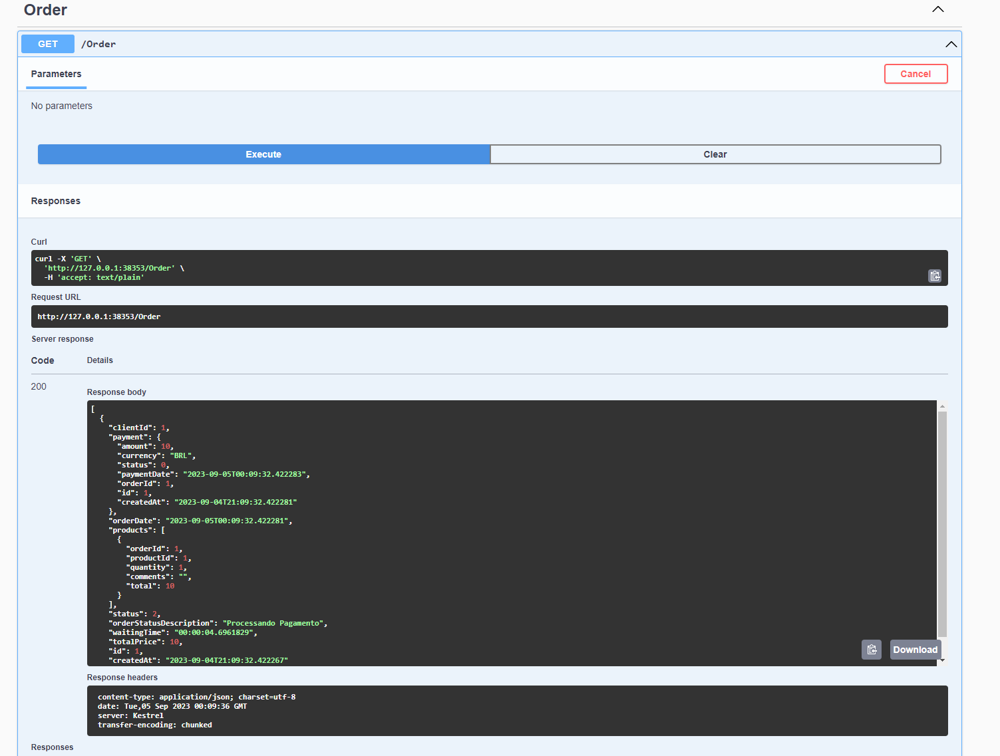

# Fiap Tech Challenge - Sistema de Totem
Esta API em .NET Core fornece funcionalidades para um sistema de lanchonete utilizando um totem. 
O sistema permite a realização de pedidos de alimentos e bebidas e o gerenciamento dos produtos disponíveis.

## Kubernets localhost com minikube
- Instale o Minikube: https://minikube.sigs.k8s.io/docs/start/
- Execute o comando:

 ```sh
minikube start -n 2 -p multinode
 ```

## Build e Push da imagem no DockerHub

Fazer login no docker


 ```sh
docker login
 ```

Substituir {usuario} pelo seu usuario do dockerhub

1. Build da aplicação

 ```sh
docker build -t fiap.totem-api:2.0 .
 ```
 
2. configuracão das tags

 ```sh
docker tag fiap.totem-api:2.0 {usuario}/fiap.totem:2.0
 ```
3. Push da imagem

 ```sh
docker push {usuario}/fiap.totem:2.0
 ```

 
## Configuração e Uso

1. Certifique-se de ter o Kubernets em sua máquina ou no ambiente que estiver executando os testes.

2. Clone este repositório para o seu ambiente local.

3. Navegue até o diretório raiz do projeto.

4. No terminal, execute o seguinte comando para aplicar o banco de dados

 ```sh
kubectl apply -f k8s/DataBase/
 ```

5. No terminal, execute o seguinte comando para aplicar o API

```sh
kubectl apply -f k8s/API/
```

6. Verificar qual a porta que o Serviço: fiap-totem-api-service está rodando:

```sh
kubectl get svc
```


6. Dependendo da configuraçao do ambiente precisa mapear a porta do kubernets com a porta da maquina.
Se estiver utilizando o minikube é póssivel fazer atraves do comando:
```sh
minikube service fiap-totem-api-service -n default --url -p multinode
```
Onde será retornado a porta para acessar o serviço:
Exemplo: http://127.0.0.1:45675

Agora basta colocoar /swagger
Ficando assim: http://127.0.0.1:45675/swagger


## Processo de criação de Produtos


```
curl -X 'POST' \
  'http://127.0.0.1:45675/Product' \
  -H 'accept: */*' \
  -H 'Content-Type: application/json' \
  -d '{
  "name": "Coca Cola 600ml",
  "price": 10,
  "description": "Coca Cola 600ml",
  "category": 2,
  "imageURL": "http://imagem.com.br/teste.png"
}'
```


Categoria de produtos:

0 - Lanche,
1 - Acompanhamento,
2 - Bebida,
3 - Sobremesa

## Processo de criação de Pedidos (checkout)


```
curl -X 'POST' \
  'http://127.0.0.1:38353/Order' \
  -H 'accept: */*' \
  -H 'Content-Type: application/json' \
  -d '{
  "clientId": 1,
  "products": [
    {
      "productId": 1,
      "quantity": 1,
      "total": 10,
      "comments": ""
    }
  ],
  "total": 10
}'
```
Obter todos os pedidos com base na prioridade:
Pronto > Em preparação > Recebido




## Processo de Cadastro de Clientes

```
curl -X 'POST' \
  'http://127.0.0.1:45675/Client' \
  -H 'accept: text/plain' \
  -H 'Content-Type: application/json' \
  -d '{
  "name": "Usuario Teste",
  "email": "email@email.com",
  "cpf": "01234567890"
}'
```

## Processo de Pagamentos


```
curl -X 'POST' \
  'http://127.0.0.1:38353/PaymentWebhook/status' \
  -H 'accept: */*' \
  -H 'Content-Type: application/json' \
  -d '{
  "paymentId": 1,
  "amount": 10,
  "currency": "BRL",
  "status": 1,
  "paymentDate": "2023-09-05T00:08:40.761Z"
}'
```
Status de pagamentos:
0 - Pending
1 - Approved
2 - Declined


## Observações

Essa api não tem implementacao de sistema de pagamento.
Foi utilizado apenas um fake Service retornando true, sempre que tiver um novo pedido.

